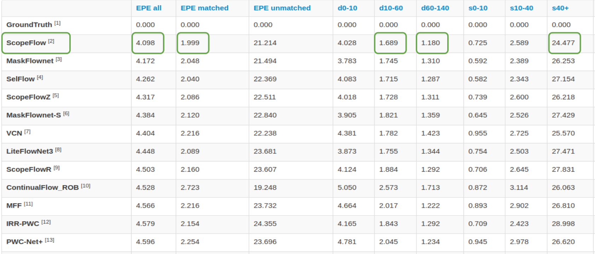

# ScopeFlow: Dynamic Scene Scoping for Optical Flow

The official Pytorch code for [ScopeFlow: Dynamic Scene Scoping for Optical Flow](https://arxiv.org/abs/2002.10770) (A. Bar-Haim & L. Wolf, CVPR 2020).


Our model was leading the [MPI Sintel benchmark](http://sintel.is.tue.mpg.de/results) from October 2019 to March 2020.   
<!-- .element height="50%" width="50%" -->

With this repository, we provide our multi-stage pipeline and configurations for training
optical flow models. We encourage others to try this pipeline and test it on other
optical flow model architectures.

## Repository structure
- Main files for execution: train.py, evaluate.py.
- Config directory: common configuration files for training and evaluation.
- Datasets directory: datasets loaders.
- Lib directory: the main training functionality.
- Utils directory: common python, pytorch and optical flow helpers.
- Models directory: initial supported models.
- Checkpoints directory: an example of a pre-trained model.


## Installation

1. This code was developed with:
   - Python 3.6
   - PyTorch 0.4.1 (Ubuntu 14+, CUDA 8.0)
2. The python packages (for CUDA 8.0) are specified in the requirements file, for
installation:
    ```
    virtualenv <venv_path> --python=python3.6
    . <venv_path>/bin/activate
    pip3 install -r requirements_cuda8.txt
    ```
3. The default model use the CUDA 8.0 correlation package, for installation:
    ```
    (optional) sudo apt-get install gcc-5 g++-5 -y
    bash -x scripts/install_correlation.sh
    ```
    - For supporting higher versions of CUDA or python,
    please refer to the [IRR-PWC](https://github.com/visinf/irr)
    repository, or to the [spatial-correlation-sampler](https://github.com/ClementPinard/Pytorch-Correlation-extension) python package.

4. Datasets used in this project:
    - [FlyingChairs Dataset](https://lmb.informatik.uni-freiburg.de/resources/datasets/FlyingChairs.en.html)
    - [FlyingChairsOcc Dataset](https://github.com/visinf/irr/tree/master/flyingchairsocc)
    - [FlyingThings3D subset](https://lmb.informatik.uni-freiburg.de/resources/datasets/SceneFlowDatasets.en.html)
    - [MPI Sintel Dataset](http://sintel.is.tue.mpg.de/downloads)
    - [KITTI Optical Flow 2012](http://www.cvlibs.net/datasets/kitti/eval_stereo_flow.php?benchmark=flow)
    - [KITTI Optical Flow 2015](http://www.cvlibs.net/datasets/kitti/eval_scene_flow.php?benchmark=flow)

    We place our datasets under 'data' directory, in the same directory as this repository,
    for reconfiguration please see the configuration files under config directory. For KITTI datasets, we extract
     both under the same directory named 'kitticomb'.


## Pretrained models
In order to download pre-trained models, please run:
```
bash scripts/download_models.sh
```

## Training
For starting a new training from scratch or from our checkpoints, use the training yamls
provided under 'config/training/' directory, and the command line arguments. Please make
sure that your data directory is properly configured.

For example, finetuning Sintel can be done with:
```
python train.py -f config/training/sintel_ft.yaml
```

In order to visualize the augmentation process (need to stop manually with ctrl + c):
```
python train.py -f config/training/sintel_ft.yaml --show_aug true --crop_min_ratio 0.5 --num_workers 0 --batch_size 1
```

In order to specify non-default GPU devices, please use CUDA_VISIBLE_DEVICES=\<COMMA_SEP_GPU_NUMBERS\>
 as a prefix to the training command.

To see all supported configurations:
```
python train.py --help
```

## Inference
For evaluation, please use the training yamls
provided under 'config/evaluation/' directory. Please make
sure that your data directory is properly configured.

For example, evaluating Sintel combined model can be done with:
```
python evaluate.py -f config/evaluation/eval_template_sintel.yaml
```

For saving the flow and occlusion results under the output directory use:
```
python evaluate.py -f config/evaluation/eval_template_sintel.yaml --save_result_png true --save_result_occ true
```

To see all supported configurations:
```
python evaluate.py --help
```

## Citation

If you find this work useful, please cite our paper:

    @misc{barhaim2020scopeflow,
        title={ScopeFlow: Dynamic Scene Scoping for Optical Flow},
        author={Aviram Bar-Haim and Lior Wolf},
        year={2020},
        eprint={2002.10770},
        archivePrefix={arXiv},
        primaryClass={cs.CV}
    }

## Credits

This repository uses training functionality (e.g. progress bar,
 general training flow, argument parser, logger and
 optical flow common functionality)
from the following great repositories:
 - [IRR-PWC & Jochen Gast](https://github.com/visinf/irr)
 - [OpticalFlowToolKit](https://github.com/liruoteng/OpticalFlowToolkit)

